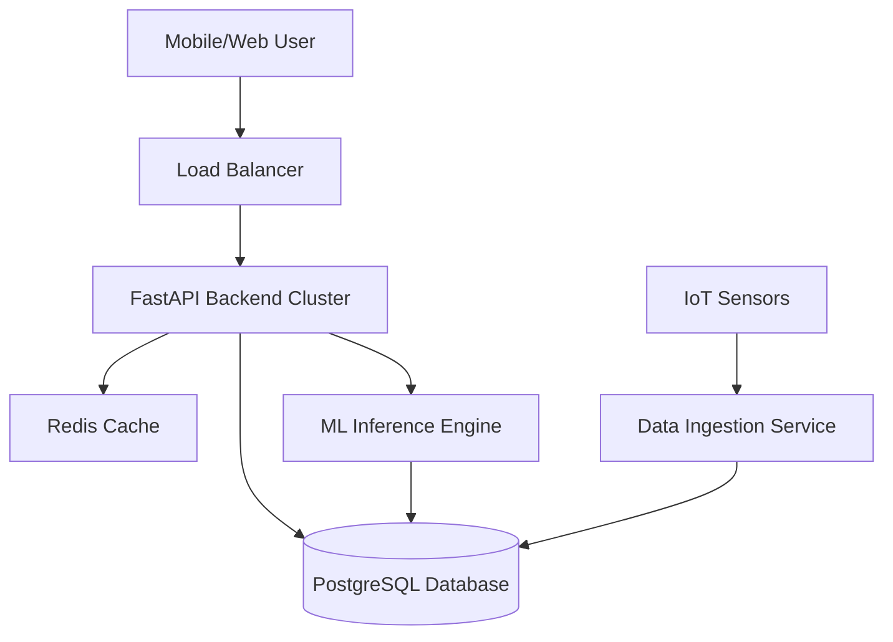

# Scalability & Architecture 🏗️

Designed to handle 1,000,000+ concurrent users across Lagos.

## 1. High-Level Architecture

## 2. Scaling Strategies

### Database Sharding
- **Strategy:** Geo-sharding based on Lagos Local Government Areas (LGAs).
- **Benefit:** Queries for "Ikeja" don't impact the database shard for "Lekki".

### Caching Layer (Redis)
- **Hot Data:** Safety scores and heatmap tiles are cached for 10-30 seconds.
- **Hit Rate:** Expected 95% cache hit rate for read-heavy heatmap requests.

### Microservices
- **Decoupling:** The "Incident Reporting" service is separate from the "Route Calculation" service.
- **Resilience:** If the ML engine slows down, incident reporting remains instant.

## 3. Performance Targets
- **API Latency:** < 100ms for 99th percentile.
- **Map Load Time:** < 2 seconds on 3G networks.
- **Throughput:** 10,000 requests per second (RPS) per node.

## 4. Infrastructure
- **Containerization:** Docker for all services.
- **Orchestration:** Kubernetes (K8s) for auto-scaling based on CPU/Memory usage.
- **CDN:** Cloudflare for serving static assets and DDoS protection.
